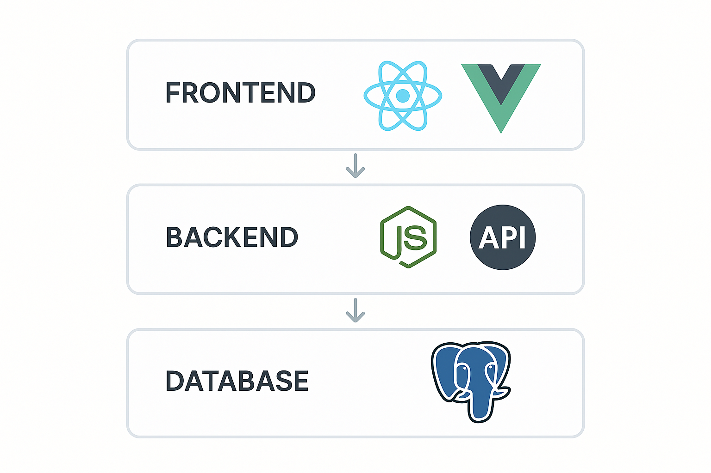
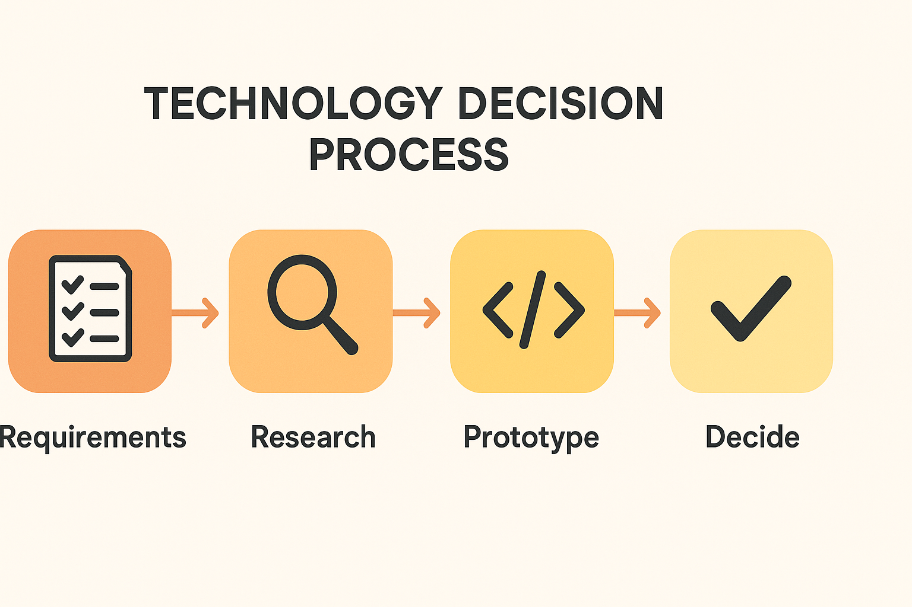

Every week, we talk to business owners who are either frustrated by technology that's holding them back or paralyzed by the sheer number of options available.

The truth is, there's no universally "right" tech stack. But there are **principles** that separate smart technology investments from expensive mistakes.

## The Stakes Are Higher Than You Think

Your technology choices today will impact:

- **How fast you can move.** Can you ship new features in days, or does everything take months?
- **How much you spend.** Not just on software, but on the people needed to maintain it.
- **Who you can hire.** Popular technologies have larger talent pools.
- **Your exit options.** If you ever sell, buyers will scrutinize your technical debt.

Getting this right matters. Let's break it down.

## The Three Questions That Actually Matter

Before looking at specific technologies, answer these:

### 1. What problem are you solving?

This sounds obvious, but you'd be surprised how often businesses start with technology preferences instead of user needs.

- A content-heavy marketing site has different requirements than an interactive web application
- A B2B SaaS product needs different infrastructure than an e-commerce store
- A company with 10 users has different scale concerns than one planning for 10,000

**Write down your core use case in one sentence.** If you can't, you're not ready to choose technologies yet.

### 2. What's your team's expertise?

The "best" technology is worthless if nobody on your team knows how to use it.

Consider:
- What languages/frameworks does your team already know?
- What can they realistically learn in 3-6 months?
- If you're hiring, what's the talent pool in your area (or remote market)?

**Leveraging existing expertise almost always beats chasing the "best" option.**

### 3. What's your time horizon?

Building for a 6-month MVP is different from building for a 10-year enterprise system.

- **Short-term (< 1 year):** Prioritize speed and simplicity. Take on reasonable technical debt.
- **Medium-term (1-3 years):** Balance speed with maintainability. Invest in good architecture.
- **Long-term (3+ years):** Prioritize flexibility and scalability. Avoid vendor lock-in.

## Our Recommended Stack for 2026

For most small-to-medium businesses building web applications, here's what we're recommending:

### Frontend

**React or Vue** — Both are mature, well-documented, and have massive ecosystems. React has more market share; Vue has a gentler learning curve.

**Astro** — For content-focused sites (blogs, marketing pages, documentation), Astro offers exceptional performance with minimal JavaScript shipped to the browser.

**Tailwind CSS** — Utility-first CSS has won. It's faster to write, easier to maintain, and produces consistent results.

### Backend

**Node.js (with TypeScript)** — Sharing one language between frontend and backend reduces context-switching. TypeScript catches errors before they hit production.

**PostgreSQL** — The most versatile database. Handles relational data, JSON, full-text search, and geospatial queries. Rarely the wrong choice.

**Serverless (when appropriate)** — AWS Lambda, Vercel Functions, or Cloudflare Workers are excellent for sporadic workloads. Don't force everything into serverless, though—sometimes a good old server is simpler.

### Infrastructure

**Vercel or Cloudflare** — For frontend hosting, these platforms offer exceptional developer experience and global performance out of the box.

**AWS or DigitalOcean** — For backend infrastructure, AWS offers the most services but steeper complexity. DigitalOcean is simpler and cheaper for straightforward deployments.

**Docker** — Containerization isn't just for enterprises. It ensures your app runs the same in development, staging, and production.

## What to Avoid

### The "Resume-Driven Development" Trap

Be wary when developers push for technologies primarily because they want to learn them. Your business isn't a sandbox.

**Red flags:**
- "Let's use Kubernetes" (when you have one server)
- "We should build our own authentication" (please don't)
- "This new framework just came out and it's amazing" (give it 18 months)

### Premature Optimization

You probably don't need:
- Microservices (until you have multiple teams)
- A data lake (until you have millions of records)
- Global CDN distribution (until you have global users)
- Real-time everything (until users actually need it)

Build for your current scale, with clear paths to upgrade when needed.

### Shiny Object Syndrome

Every week, there's a new framework, database, or platform claiming to solve all your problems. Most won't exist in 5 years.

**Stick to technologies that have:**
- 5+ years of production use
- Active maintenance and community
- Multiple large companies depending on them
- Clear migration paths if you need to leave

## The AI Layer

No 2026 tech discussion is complete without mentioning AI. Here's our pragmatic take:

**Integrate, don't build.** Unless AI is your core product, use APIs from OpenAI, Anthropic, or similar providers. Building your own models is expensive and rarely worth it.

**Start with specific use cases.** Customer support chatbots, content generation, data extraction, and code assistance are mature. More speculative applications (like autonomous agents) should wait.

**Keep humans in the loop.** AI makes mistakes. For anything consequential, build workflows that let humans review AI outputs.

## Making the Decision

Here's a practical framework:

1. **List your requirements** (what must it do?)
2. **Identify constraints** (budget, timeline, team skills)
3. **Research 2-3 options** for each layer (don't boil the ocean)
4. **Build a small prototype** with your top choice
5. **Get feedback** from your team on developer experience
6. **Commit and move forward** — the worst decision is no decision

## A Note on Technical Debt

Every growing business accumulates technical debt. That's okay—it's the cost of moving fast.

What matters is:
- **Knowing where the debt is.** Document shortcuts and trade-offs.
- **Paying it down regularly.** Budget 20% of engineering time for maintenance.
- **Not letting it compound.** Some debt needs to be addressed before adding new features.

Pretending debt doesn't exist is how you end up with systems that take 6 months to change anything.

## When to Replatform

Sometimes, the right move is starting fresh. Consider it when:

- Your current system can't support core business requirements
- The cost of maintaining the old system exceeds rebuilding
- You can't hire anyone willing to work on it
- Security vulnerabilities are unfixable

**Replatforming is expensive and risky.** Don't do it for aesthetics or because the current tech isn't fashionable. Do it when the business case is undeniable.

---

Technology decisions are business decisions. The goal isn't to use the "best" tools—it's to use the right tools to solve your specific problems.

Need help evaluating your options? [We're happy to talk through your situation](/contact).
